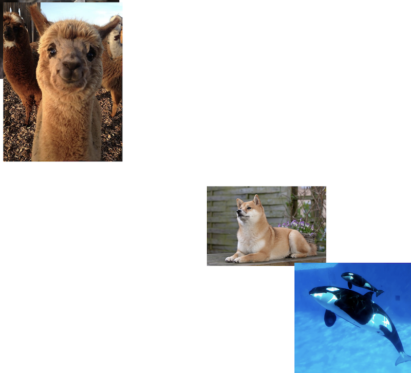

## Description

Update the CSS file to reproduce the following:  


The alpaca stays at the top left of the screen but must appear in front of the cat image  
The cat is moved to the top left of the screen  
The dog must be 50% away from the top and from the left of the screen and always stay there (even when scrolling down)  
The whales must be moved to the bottom left of the screen

## Reference

Here are all the css properties you need

```
z-index
top
left
position
bottom
right
```
