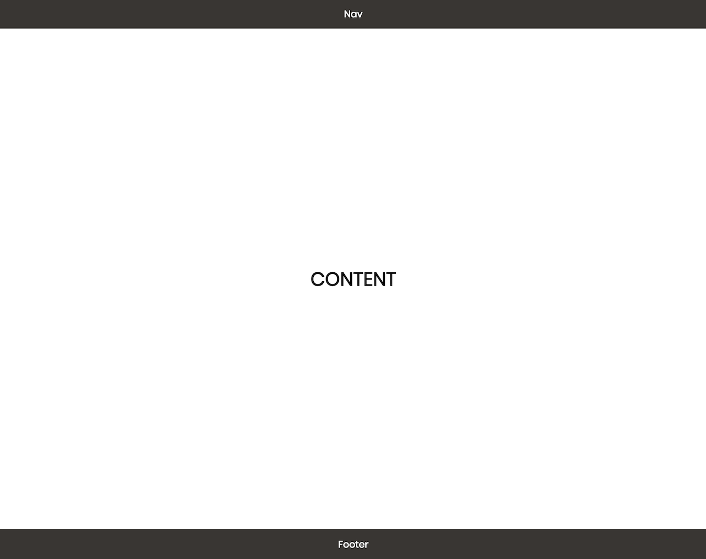

## Description

Create an HTML file and a CSS file that reproduces the following:


This is a full screen background image with text in the center

## Reference

Your HTML should have the following structure:

```
<!DOCTYPE html>
<html>
   <head>
       <link rel="stylesheet" type="text/css" href="style.css">
   </head>
   <body>
      ...
   </body>
</html>
```

Where style.css is the name of your css file.

Use the poppins font and set the body margin to 0

Use the provided image in the imgs folder

To style your main `<div>` with a background image, you will need to use:

```
background-image: url('imgs/bg.jpg'); /* you need to specify the path to the file */
background-size; /* Use this to have the image cover the full space */
background-position /* Use this to center the background image */
```

Full list of needed CSS properties

```
margin
font-family
display
align-items
justify-content
min-height
background-image
background-size
background-position
color
```
