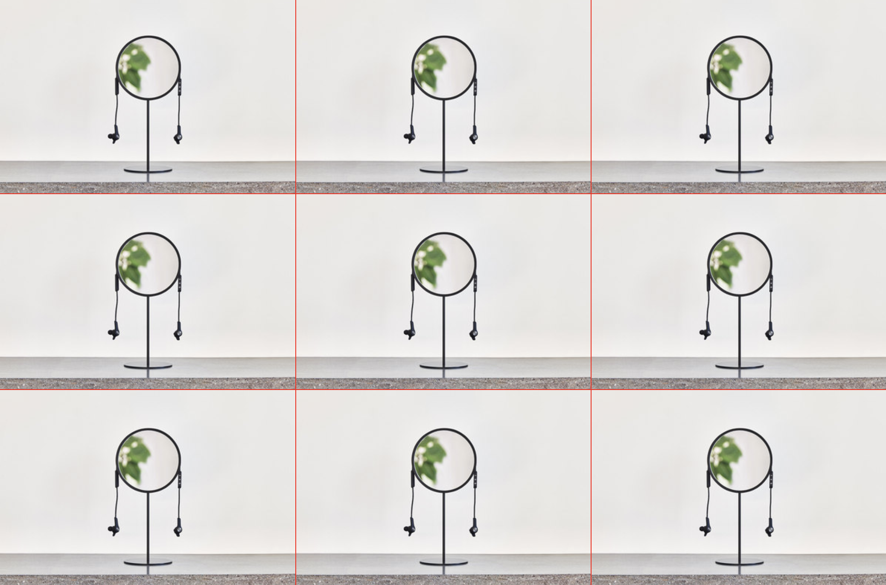

# Optional exercise

## Description

Create an HTML file and a CSS file that reproduces the following:


Don't use grid or flexbox  
Hint: Use calc()

- Example use:

```
min-height: calc(100vh - 20px);
```

## Submission

It will automatically be submitted the next time you push.

## Reference

Your HTML should have the following structure:

```
<!DOCTYPE html>
<html>
   <head>
       <link rel="stylesheet" type="text/css" href="style.css">
   </head>
   <body>
      ...
   </body>
</html>
```

Where style.css is the name of your css file.

You will need to set the height on your `<div class="container">`

```
min-height: 100vh;
```

This specifies that the content height should be at least as big as the full viewport height

_Optional_  
Use the Poppins font
