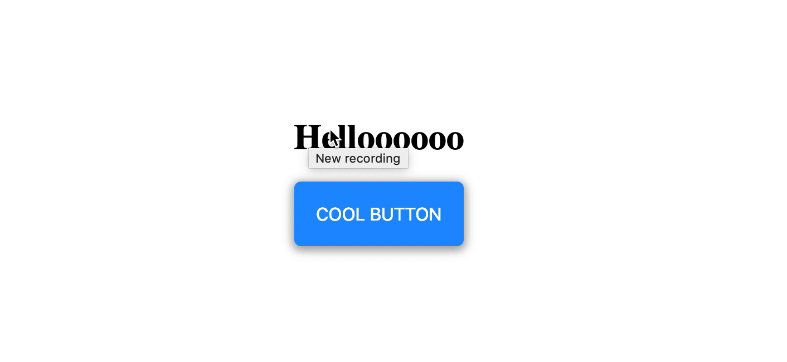

## Description

Update the HTML file CSS file to reproduce the following:


## Reference

Use the `animation` property with 1s duration and _ease-in-out_ easing function
Use `translate()` and `scale()` for the transform animations
Use `cursor: pointer` on the button to change the cursor to a hand
Use `text-transform` uppercase
Check the `box-shadow` css property on google, w3schools has some examples on how it works

```
@keyframes
transform
opacity
animation
padding
border
background-color
color
box-shadow
border-radius
font-size
cursor
text-transform
hover
```

Bonus:  
Make the button do a 360deg rotation when it bounces



Use the syntax `transform:scale() rotate()` in your keyframe
