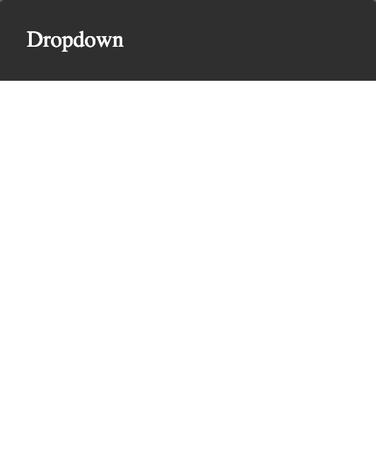

## Description

Update the HTML file and CSS file to reproduce the following:  


## Reference

Needed CSS properties

```
position
top
left
display
margin
list-style-type
padding
background-color
:hover
```
